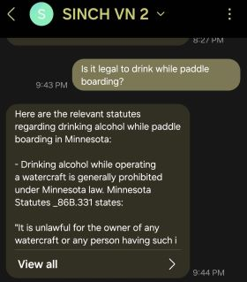
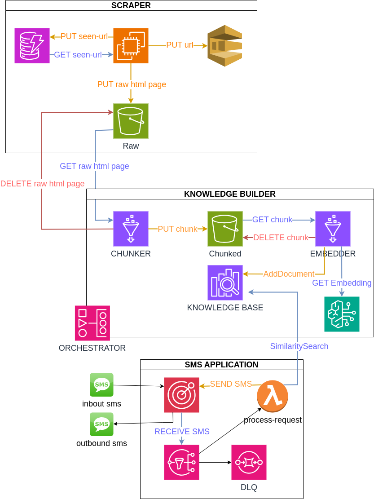
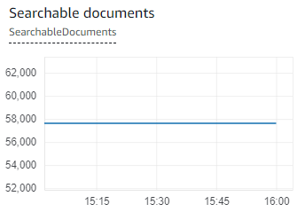

# mn-revisor-chat

A chat app for querying Minnesota law from the MN Revisor's website.



(Note: It's actually statute 86B.33, subdivision 1.)

# Architecture



## How it Works

A crawler and scraper collaborate to find, download, and parse statutes from the MN Revisor website.
These statutes are indexed in an OpenSearch vector index.
A RAG implementation is used to answer user questions.
Users text a Sinch virtual number, triggering a RAG lookup and answer generation, with responses sent back via Sinch.

## The Parts

### Data Population

1. **main-bucket**: S3 bucket storing raw webpages with **raw/** object prefix, and statute subdivisions with **chunk/** object prefix.
1. **table-1**: DynamoDB table tracking crawled URLs.
1. **url-dq**: SQS standard queue with DLQ for URLs to be crawled.
1. **crawler service**: ECS service with autoscaling, up to 6 tasks, checks **url-dq** and **table-1**, downloads and stores webpages in **s3://main-bucket/raw/**.
1. **raw-events-dq**: SQS standard queue with DLQ for `s3::PutObject` events with ObjectPrefix **raw/**
1. **scraper**: Lambda parses raw web pages, extracts URLs (sent to **url-dq**) and statutes (stored in **s3://main-bucket/chunk/**).
1. **to-index-dq**: SQS standard queue with DLQ for `s3::PutObject` events with ObjectPrefix **chunk/**
1. **OpenSearch vector index**: holds the document embeddings along with their IDs.
1. **indexer**: Lambda gets object keys from **to-index-dq**, obtains embeddings, and stores them in OpenSearch vector index. AWS Bedrock is used to obtain Amazon Titan V2 embeddings.

To initiate data population, an operator triggers **invoke-trigger-crawler** Lambda, which spawns **trigger-crawler** ECS task to clear **table-1** and **url-dq**, and send seed URL to **url-dq**.

### RAG Answerer

1. **User** sends an SMS to a Sinch virtual number.
1. **Sinch** triggers a webhook.
1. **webhook** sends a POST request to **API Gateway**.
1. **API Gateway** triggers answerer Lambda.
1. **answerer** Lambda processes the message, gets the prompt embedding, finds top k matching documents from OpenSearch, fetches documents from **s3://main-bucket/chunk/**, augments the prompt, sends it to Claude, and texts the response back to the user. AWS Bedrock is used to obtain Amazon Titan V2 embeddings and Claude for answer generation.

### Security

All components are within a VPC. The **crawler** and **answerer** are in private-with-egress subnets, while the rest are in private-isolated subnets. OpenSearch EC2 instances are in private-isolated subnets. Security groups allow inbound traffic only from within the VPC. IAM roles are minimally permissive for necessary operations.

# Setup

## Prerequisites:

1. Golang
1. AWS CLI
1. AWS CDK v2
1. Docker

## Steps

### Sinch Setup

1. **Create an Account**: Sign up for a [Sinch](https://www.sinch.com/) account.
1. **Create a Virtual Number**: Go to **Numbers > Overview > GET 10DLC**, search, and _Get_ a number.
1. **Create a Conversation API App**: Navigate to **Conversation API > Overview**. Create a _NEW APP_, then select it. Set up **Channels > SMS** and choose a Service Plan ID.
1. **Register a Webhook**: For testing, get a webhook URL from a test site like [webhook.site](https://webhook.site/). Then go to **Conversation API > Apps > [app created in previous step] > ADD WEBHOOK** and enter the webhook URL in the Target URL field. Under Triggers, select MESSAGE_INBOUND.
1. **Send a Test Message**: Send a test message to the Sinch virtual number. The response should appear on the [webhook.site](https://webhook.site/) page. You might need to verify your personal number under **Numbers > Verified Numbers**.

### Infrastructure Setup

Execute these instructions within the **infra** directory.

1. **Create config.yaml**: Create a config.yaml file with the following contents:
   Obtain the Sinch config values from the Sinch website.

```
azCount: 1
nonce: <enter some nonce here>
sinchApiToken:
sinchServiceId:
sinchVirtualPhoneNumber:
```

`sinchVirtualPhoneNumber` number is obtained from **Numbers > Your virtual numbers**.
`sinchServiceId` and `sinchApiToken` is obtained from **SMS > Service APIs**.

2. **Deploy Stacks**: Run the helper script `./deploy.sh` to deploy all the stacks.
3. **Add the API Gateway URL to the Webhook**: Obtain the API Gateway URL and add it as a Sinch webhook (see **Sinch Setup > Register a Webhook**). Example output:

```
Outputs:
answerer-stack-mnrevisor.ApiEndpoint = https://abcd.execute-api.us-east-1.amazonaws.com/api/v1
```

### Index Population

1. Sign in to the AWS console.
1. Navigate to the Lambda page and run the **invoke-trigger-crawler** Lambda with any event.
1. Wait until all the SQS queues are empty (i.e., crawling has completed). This should take approximately 4 hours.
1. Should also see many documents in the OpenSearch vector index (**AWS Console > OpenSearch > opensearch domain > Instance health > Cluster health > Overall health > Searchable documents**).



### Ask a Question

Once the OpenSearch Vector Index is fully populated, it's ready to answer questions. Text a test prompt to the Sinch virtual number and receive a response after a minute or so. If you've configured a testing webhook site, you should see the inbound sms on the webhook site page.

# Code Structure

All code is found in the **code** workspace, following a hub-and-spoke architecture.

- **core**: Contains domain types.
- **application**: Uses types from the **core** module to implement various functions.
- **infrastructure**: Implements various types from the **core** module and includes the _settings_ package.
- **cmd**: Contains multiple directories that implement _main_. Each _main_ initializes the necessary infrastructure, runs as a container or Lambda, and executes the corresponding application function.
- **helpers**: Implements utility functionality used by the **application** module.

## Infrastructure

- **clients**: Retrieves web pages. Implements the _core.WebClient_ interface.
- **comms**: Sends SMS. Implements the _core.Comms_ interface.
- **indexers**: Interacts with OpenSearch. Implements the _core.SearchIndex_ interface.
- **loggers**: Performs logging. Implements the _core.Logger_ interface.
- **queues**: Interacts with AWS SQS. Implements _core.Queue_, _core.RawEventsQueue_, and _core.URLQueue_ interfaces.
- **scrapers**: Scrapes data from MN Revisor Statutes. Implements the _core.MNRevisorStatutesScraper_ interface.
- **settings**: Retrieves settings from the environment (production) or **settings.env** file (development).
- **stores**: Interacts with AWS DynamoDB and AWS S3. Implements the _core.SeenURLStore_, _core.RawDataStore_, and _core.ChunksDataStore_ interfaces.
- **tasks**: Interacts with AWS ECS. Implements the _core.Invoker_ interface.
- **types**: Contains message types received by AWS Lambda.
- **vectorizers**: Interacts with AWS Bedrock. Implements the _core.Vectorizer_ and _core.Agent_ interfaces.
- **watchers**: Handles interrupt events. Implements the _core.InterruptWatcher_ interface.

# Testing

Integration tests are written for all packages in the **infrastructure** module. They can be run with `go test`. The tests in the **comms** package require running with `MY_PHONE_NUMBER=xxxx go test`. Before running the integration tests, ensure the environment is set up.

## Localstack Setup

Localstack is used to test the **queues** and **stores** packages. Ensure [Localstack](https://www.localstack.cloud/) and [awslocal](https://github.com/localstack/awscli-local/blob/master/README.md) are installed.

## OpenSearch Setup

Run the OpenSearch container locally. Do this by pasting the [docker-compose.yml](https://opensearch.org/docs/latest/install-and-configure/install-opensearch/docker/#sample-docker-composeyml) file into a local directory and running it with `docker-compose up`. Set the OpenSearch `username` and `password` appropriately in the docker-compose file.

## Run `setup-environment.sh`

Update the `SINCH_*` and `OPENSEARCH_*` environment variables at the start of the **setup-environment.sh** file as necessary. Run the `./setup-environment.sh` script to write a **settings.env** file. This script is idempotent. Once completed, you can run the integration tests.

# Building

Navigate to the code directory where the **Makefile** is located.

## Build Commands

- Build Lambda commands with `make build-lambda cmd=<cmd>`.
- Build ECS commands with `make build-ecs cmd=<cmd>`.

## Build Outputs

- All builds are located in the `.build` directory.
- Build artifacts for a specific command are found in the `.build/<cmd>` directory.
- Lambda requires a **bootstrap** executable contained in the zip file `<cmd>.zip`.
- ECS requires a Docker image that runs a Go executable.

### Lambda Commands

- `answerer`
- `indexer`
- `invoke_trigger_crawler`
- `raw_scraper`

### ECS Commands

- `crawler`
- `trigger_crawler`
