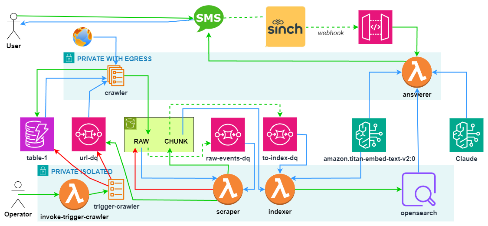

# mn-revisor-chat
A chat app that allows asking questions about Minnesota law found in the MN Revisor's Office website.

## Architecture

### Web Scraper

#### DynamoDB - Data Model

DynamoDB is used to determine if the url has been seen before.
The access patterns are put url and get url.
One attribute "url" would suffice.
